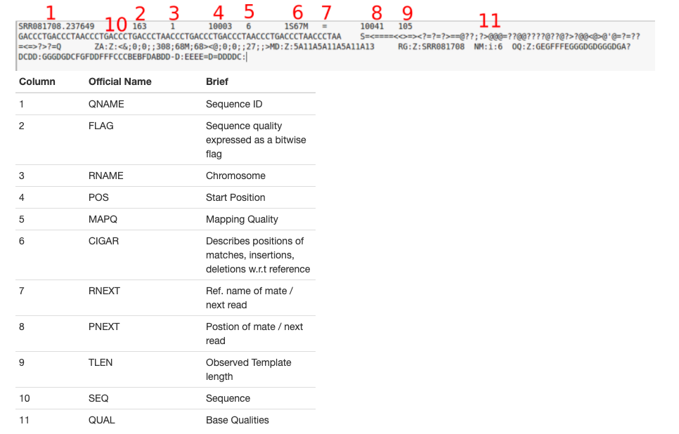

3/28/20

1) Download metaT file

Example with xml link:
```
curl 'https://genome.jgi.doe.gov/portal/ext-api/downloads/get_tape_file?blocking=true&url=/IncBWC4MmetaG/download/_JAMO/59a93bde7ded5e41edd8f2b0/11860.3.224398.ATTGAGC-GGCTCAA.fastq.gz' -b cookies > Inc_BW-C-4-M_metag.fastq.qz
```
2) run FastQC
*found out adapter is Illumina universal adapter
3) run trimmomatic with the following command on a screen on genobacter

```
java -jar /usr/share/java/trimmomatic-0.39.jar SE -threads 4 MetaT/Native-BW-C-4-M_metat.fastq.gz MetaT/trimmed/Native-BW-C-4-M_metat.trim.fastq.gz ILLUMINACLIP:TruSeq2-SE.fa:2:40:15  SLIDINGWINDOW:4:20
```

note: unsure if unpaired, but only 1 file

    used TruSeq2-SE for time being
    
    followed steps from workshop

4) BWA

potentially useful: https://github.com/McMahonLab/geodes/blob/c4e056ff1e34d29c8fbd9e2a72b1701faf82a8c8/bioinformatics_workflow/lab_notebooks/labnotebook_02mapping.Rmd
another scripting option: https://pyjip.readthedocs.io/en/latest/examples/bwa.html

First, index genomes (can be fa or fasta file)

```
bwa index
```

RUN IN THE FOLLOWING IN FOLDER WITH INDEXED GENOMES

```
bwa mem -t 10 3300020651.fa.6.fa MetaT/trimmed/Native-BW-C-4-M_metat.trim.fastq.gz > Results/sam/Native-BW-C-4-M_metat_330002065.aligned.sam
```
Here's what the same output should look like:

I can't seem to figure out how to specify differenct cutoffs-it seems that many people edit the sam output using grep to get the quality scores they want.

4/6/20

Scripting the process for Native-BW-C-4-M_metat alignment to all genomes:
```
*this doesn't work, use below*
for file in `dir -d *fa` ; do
    echo "working with file $file" 
    bwa index $file
    sam=../Results/sam/Native-BW-C-4-M_metat_$file.aligned.sam
    bam=../Results/bam/Native-BW-C-4-M_metat_$file.aligned.bam
    sorted_bam=../Results/sorted_bam/Native-BW-C-4-M_metat_$file.aligned.sorted.bam
    bwa mem -t 20 $file ../MetaT/trimmed/Native-BW-C-4-M_metat.trim.fastq.gz > $sam
    samtools view -S -b $sam > $bam 
    samtools sort -o $sorted_bam $bam
    samtools index $sorted_bam
done
``` 

Ran the script, mostly worked except none of the bam files were sorted and therefore couldn't be indexed.

Error message:
```
[E::hts_open] fail to open file '../Results/sorted_bam/Native-BW-C-4-M_metat_3300020916.fa.5.fa.aligned.sorted.bam'
[bam_sort_core] fail to open file ../Results/sorted_bam/Native-BW-C-4-M_metat_3300020916.fa.5.fa.aligned.sorted.bam
[E::hts_open] fail to open file '../Results/sorted_bam/Native-BW-C-4-M_metat_3300020916.fa.5.fa.aligned.sorted.bam'
```

I also got an error with one of the genomes, but this was the only one:

```
working with file 3300020916.fa.5.fa
[M::bwa_idx_load_from_disk] read 0 ALT contigs
[M::process] read 1405888 sequences (200000023 bp)...
[E::bns_fetch_seq] begin=7100674, mid=7100745, end=6522026, len=578648, seq=0x7fd56fb09010, rid=466, far_beg=6519512, far_end=6522026
bwa: bntseq.c:450: bns_fetch_seq: Assertion `seq && *end - *beg == len' failed.
Aborted (core dumped)
``` 

4/7/20:
Today I'd like to
1) figure out what caused this genome to fail
2) fix what's wrong with the sorted bam script

Moving forward, I want to
* write a script to download the remaining MetaT files OR use SRA toolkit

1) Looking online, it seems to be an indexing error. I reran the index and ran bwa mem again, and it seems to be working. Make sure to convert to bam.

2) Turns out the code from DataCarpentry was for a different version of samtools I think - the syntax was wrong. Now samtools should run as samtools sort -o INPUT OUTPUT. Unsure why this works but it did.

NEW SCRIPT, should work:
```
for file in `dir -d *fa` ; do
    echo "working with file $file" 
    bwa index $file
    sam=../Results/sam/Inc_BW-C-4-M_metag_$file.aligned.sam
    sorted_bam=../Results/sorted_bam/Inc_BW-C-4-M_metag_$file.aligned.sorted.bam
    bwa mem -t 40 $file ../MetaG/trimmed/Inc_BW-C-4-M_metag.trim.fastq.qz > $sam
    echo "now converting sam to sorted bam $file"
    samtools sort -O bam -T tmp -@ 40 $sam > $sorted_bam 
    echo "now indexing sorted bam $file"
    samtools index $sorted_bam
done
``` 

For now, sort all bams.

In bam directory:
```
for file in `dir -d *bam` ; do
    sorted_bam=`echo "$file" | sed 's/.bam/.sorted.bam/'`;   
    echo "working with $file"
    samtools sort -O bam -T tmp $file > ../sorted_bam/$sorted_bam;     
done
```
Then index in sorted_bam directory:
```
for file in `dir -d *bam` ; do
    echo "working with $file"
    samtools index $file     
done
```
4/13/20
Indexing worked, so we're through that part of the workflow.

Still don't know what the max mapq score is (37 vs 42), but have figured out that for BWA the calculation is -10 log(Pr) (https://sequencing.qcfail.com/articles/mapq-values-are-really-useful-but-their-implementation-is-a-mess/).
Therfore, a score of 20 has a 1% probability of being mismatched.

There's a program called BAMQC which plots the quality scores, which may be useful so I can see what kind of scores I'm getting. It's not on genobacter or MGHPCC so I could download if I really need it.

Looking at the sam files I got so far, there seem to be few matches, so a lot of mapq scores of 0.
I also figured out what the most common flags were:

flag 4: unmapped
flag 0: fwd strand
flag 16: reverse strand

I found a list of samtools commands which are useful:
https://gist.github.com/davfre/8596159

Most useful:
Number of reads:
```
samtools view -c file.bam
```

Stats:
```
samtools flagstat filename.bam
```
Example output:
137136530 + 0 in total (QC-passed reads + QC-failed reads)
0 + 0 secondary
1898 + 0 supplementary
0 + 0 duplicates
603518 + 0 mapped (0.44%:-nan%)
0 + 0 paired in sequencing
0 + 0 read1
0 + 0 read2
0 + 0 properly paired (-nan%:-nan%)
0 + 0 with itself and mate mapped
0 + 0 singletons (-nan%:-nan%)
0 + 0 with mate mapped to a different chr
0 + 0 with mate mapped to a different chr (mapQ>=5)

Supplementary means chimeric/non-linear alignment

Output only mapped reads:
```
samtools view -F 0x04 -b in.bam > out.aligned.bam
```

Minimum alignment quality (in this example, mapq>=30 so probability .1%?)
```
samtools view -q 30 -b in.bam > aligned_reads.q30.bam
samtools view -q 30 -c in.bam #to count alignments with score >30
```

Different mapq levels to try:
99.9% or mapq of 30
99% or mapq of 20
97% or mapq of 15
95% or mapq of 13

4/16/20:

All genomes and reads summary:

```
parallel --tag samtools view -c  ::: *.bam > reads.csv
```

Tomorrow:
do the whole pipeline with the metaG file

can i adjust samtool threads?

4/18/20:
Adjust sam tools threads with @

Ran out of space, trying to convert all sams to sorted bams (deleting all bams to secure space)
```
for file in `dir -d *sam` ; do
    echo "working with file $file" 
    sorted_bam=../sorted_bam/$file.sorted.bam
    samtools sort -O bam -T tmp -@ 40 $file > $sorted_bam 
    echo "now indexing sorted bam $sorted_bam"
    samtools index $sorted_bam
done
```

4/28/20

For some reason the bams are empty. I think I'm just going to rerun everything:
```
for file in `dir -d *fa` ; do
    echo "working with file $file" 
    sorted_bam=../Results/sorted_bam/Native-BW-C-4-M_metat/Native-BW-C-4-M_metat_$file.sorted.bam
    bwa mem -t 60 $file ../MetaT/trimmed/Native-BW-C-4-M_metat.trim.fastq.gz | samtools sort -O bam -T tmp -@ 60 > $sorted_bam
    echo "now indexing sorted bam $file"
    samtools index $sorted_bam
done
```

Get 3 quality files for all bams:

```
CHECK BEFORE USING
for file in `dir -d *.sorted.bam` ; do
  echo "working with file $file"
  q30=`echo "$file" | sed 's/.sorted.bam/.q30.sorted.bam/'`
  q20=`echo "$file" | sed 's/.sorted.bam/.q20.sorted.bam/'`
  q15=`echo "$file" | sed 's/.sorted.bam/.q15.sorted.bam/'`
  samtools view -q 30 -b $file > $q30
  samtools view -q 20 -b $file > $q20
  samtools view -q 15 -b $file > $q15
done
```

Get all reads
Repeat for all other files?

5/3/20
Downloaded all files, now trim them all:

```
for file in `dir -d *.fastq.gz` ; do
  echo "working with file $file"
  trim=`echo "$file" | sed 's/.fastq.gz/.trim.fastq.gz/'`
java -jar /usr/share/java/trimmomatic-0.39.jar SE -threads 40 $file ./Trim/$trim ILLUMINACLIP:../TruSeq2-SE.fa:2:40:15  SLIDINGWINDOW:4:20
done
```

Then map and sort

```
for genome in `dir -d *fa` ; do
  for meta in ../MetaT/*.trim.fastq.gz ; do
    echo "working with genome $genome and metat $meta" 
    file=`echo "$meta" | sed 's/.fastq.gz//' | sed 's/..\/MetaT\///'`
    echo "$file"
    sorted_bam=../../../BHD1/Arianna/Results/$file.$genome.sorted.bam
    echo "$sorted_bam"
    bwa mem -t 60 $genome $meta | samtools sort -O bam -T tmp -@ 60 > $sorted_bam
    echo "now indexing sorted bam $sorted_bam"
    samtools index $sorted_bam
  done
done
```


